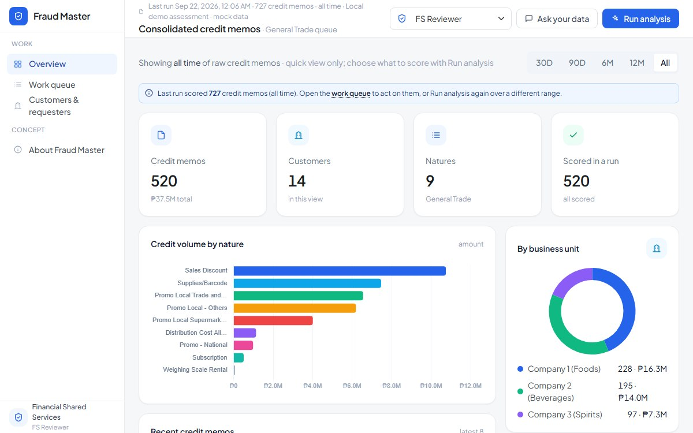

# Fraud Master

A credit memo risk review prototype for a finance shared services team: score every credit memo, route the risky ones to the right reviewer, and record a decision with a reason.

**Live:** https://fraud-master-demo.netlify.app



> All data is generated in the browser, with fraud scenarios planted on purpose. Customer, requester, approver, and business unit names are placeholders ("GT Customer 01", "Requester 01"), not real people or organizations.

## The problem

Credit memos reduce what a customer owes, which makes them a common place for errors and abuse: a discount posted after a promo ended, an amount just under someone's approval limit, the same credit posted twice. Reviewing every memo by hand does not scale, and reviewing a random sample misses the ones that matter.

## Who it's for

| Role | Lands on | Can do |
| --- | --- | --- |
| FS Reviewer | Work queue (General Trade) | Review cases and record decisions |
| FS Team Lead / QA | Work queue (all channels) | Decide cases and check a QA sample |
| FS Controls Lead | Controls | Everything above, plus rule performance and tuning |
| Internal Audit / Risk | Controls | Read-only investigation |

## How a memo is scored

A rules engine checks every memo against two kinds of signal.

| Control rules | Patterns |
| --- | --- |
| Requestor is also the approver | Near-duplicate of another credit |
| Amount above the approver's delegated limit | Sub-limit cluster that sums over the approval limit |
| Promo approval expired before posting | Unusual credit frequency for this customer |
| Posted before the promo activity started | Amount far above this customer's norm |
| Charged to a closed Internal Order | Posted at period-end |
| Mandatory attachment missing | Posted outside business hours |

The score routes each memo to **Investigate**, **Review**, or **Straight-through**. Reviewers open a case to see why it was flagged, a checklist, related memos, and the customer's and requester's history, then record a decision with a reason code.

## Key decisions

- **Rules decide, AI explains.** Scoring and routing are deterministic, so every flag can be traced to a rule. AI only writes plain-language explanations and answers questions.
- **Mask before anything leaves the page.** Customer and people names are swapped for aliases before any AI call, and answers are mapped back locally, so the model never sees who is involved.
- **Tuning is a controlled job.** Only the Controls Lead can change rule weights, hard stops, and which rules are on. Rules export and import as JSON so a change can be reviewed like any other.
- **Works without AI.** With no AI proxy configured, the app falls back to a local assessment, and the full queue still works.

## Architecture


## Running it

Open `index.html` in a browser, or serve the folder with any static server:

```bash
npx serve .
```

To enable AI explanations, host the page behind a proxy that answers `POST /api/complete` in the Anthropic Messages response format. The proxy is not part of this repository.

## Tech

HTML, CSS, and vanilla JavaScript in one file, with Bootstrap 5 for layout and Chart.js for charts.

## What I'd do next

- Load real credit memo extracts and measure how many planted issues each rule catches
- Track reviewer decisions over time to tune weights from outcomes instead of judgment
- Add a pre-posting check so the same rules block a risky memo before it posts

Built by [Joseph Villanueva](https://joseph-villanueva-portfolio.vercel.app).
